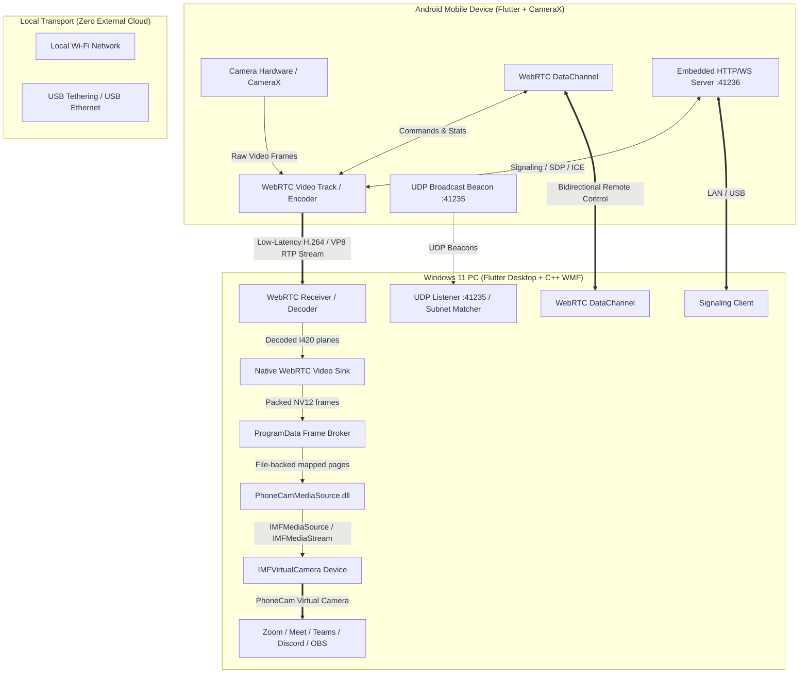

# PhoneCam Architecture

PhoneCam is a high-performance, low-latency system designed to use an Android smartphone as a native Windows 11 physical-like webcam over local Wi-Fi and USB Tethering.

---

## 1. Subsystems Overview

### A. Mobile Application (`apps/mobile`)
- **UI Framework**: Flutter with Riverpod state management.
- **Capture Engine**: `flutter_webrtc` / Camera hardware integration.
- **Embedded Server**: Custom Dart HTTP/WebSocket server listening on port `41236`.
- **Discovery Beacon**: Periodically broadcasts UDP announce packets on port `41235`.
- **Remote Control Receiver**: Receives versioned JSON commands via WebRTC DataChannel for zoom, focus, exposure, torch/flash, resolution, framerate, and camera switching.

### B. Windows Application (`apps/windows`)
- **UI Framework**: Flutter Desktop with modern dark theme and real-time telemetry.
- **Discovery Service**: Listens for UDP beacons on port `41235` and classifies connections by analyzing network adapters (Wi-Fi vs USB Tethering).
- **WebRTC Client**: Initiates local peer connection with Android device over local IP.
- **Virtual Camera Bridge**: Dart FFI controls camera lifetime and exposes diagnostics; decoded planes are published directly by the native WebRTC renderer without a full-frame Dart copy.

### C. Windows Media Foundation Virtual Camera (`native/windows/virtual_camera`)
- **API**: Windows 11 `MFCreateVirtualCamera` API (`IMFVirtualCamera`).
- **COM Interfaces**: Implements `IMFActivate`, `IMFMediaSourceEx`, `IMFMediaStream2`, `IMFSampleAllocatorControl`, `IMFGetService`, and `IKsControl`.
- **Cross-session transport**: Lock-free, double-buffered file mapping under `%ProgramData%\PhoneCam`, accessible to the desktop producer and Windows Camera Frame Server.
- **Pixel Formats**: NV12 broker with negotiated `NV12`, `RGB32`, and `YUY2` output at 720p/1080p30.
- **Synthetic Frame Engine**: Integrated SMPTE color bars + timestamp + moving sync generator for standalone Phase 6 validation.

### D. Shared Packages
- **`packages/shared_models`**: Common data classes (`DeviceInfo`, `DeviceCapabilities`, `CameraInfo`, `ConnectionStats`, `VideoFormat`, `TypedErrors`).
- **`packages/protocol`**: Versioned JSON message envelopes, command builders, serializers, and response envelopes.
- **`packages/discovery`**: UDP broadcast peer discovery and local network adapter analyzer.
