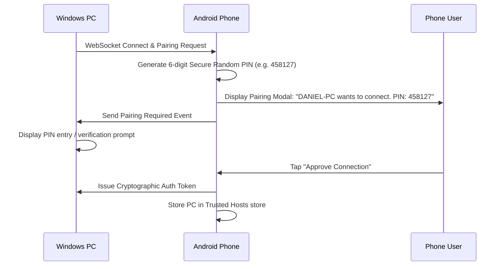

# PhoneCam Pairing & Security Specification

PhoneCam incorporates a zero-trust LAN pairing mechanism to ensure unauthorized devices on the local network cannot access your phone's camera feed without explicit consent.

---

## 1. 6-Digit PIN Pairing Flow

---

## 2. Persistent Trusted Hosts Store

- After initial pairing approval, the phone securely stores a `TrustedHost` record:
  - `deviceId`: Unique hardware/client UUID of the PC.
  - `deviceName`: Friendly host name (e.g. `DANIEL-PC`).
  - `authToken`: Random high-entropy authorization secret.
  - `pairedAt`: Pairing timestamp.
  - `lastConnectedAt`: Timestamp of last active streaming session.
- Subsequent connections from the same PC pass the `authToken` during the initial handshake, permitting instant auto-connection without re-entering PINs.
