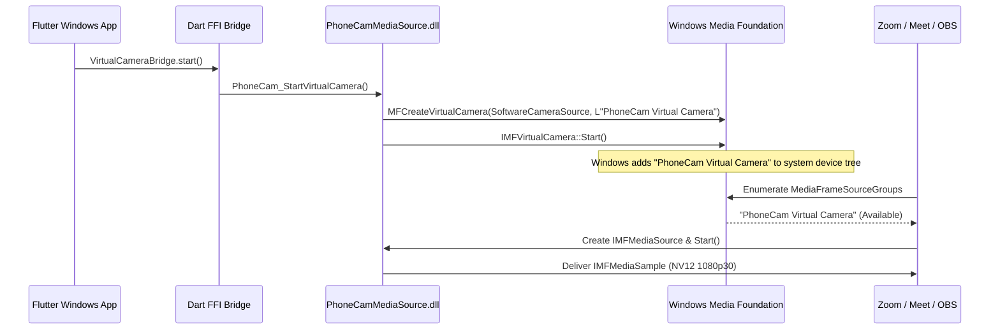

# Windows 11 Media Foundation Virtual Camera Implementation

PhoneCam integrates directly with the modern **Windows Media Foundation Virtual Camera API** (`MFCreateVirtualCamera`), introduced in Windows 11 (Build 22000+).

---

## 1. Virtual Camera Registration Flow

---

## 2. Media Source & Stream Architecture

1. **`IMFVirtualCamera`**: Registered via `MFCreateVirtualCamera` with device name **"PhoneCam Virtual Camera"** and lifetime set to `MFVirtualCameraLifetime_Session`.
2. **`IMFMediaSource`**: Media Foundation source interface representing the live capture device (`PhoneCamMediaSource`).
3. **`IMFMediaStream`**: Manages media type negotiation (`MFVideoFormat_NV12`, `MFVideoFormat_RGB32`, `MFVideoFormat_YUY2`), presentation descriptors, and processes `RequestSample(IUnknown* pToken)`.
4. **`IMFSample` & `IMFMediaBuffer`**: Memory buffers wrapping incoming YUV/NV12 frame data with timestamps (`SampleTime` in 100ns HNS units) and duration (`SampleDuration`).

---

## 3. Pixel Format and Conversions

PhoneCam optimizes the video path by eliminating unnecessary color space conversions:

- **Primary Pipeline**: `WebRTC I420/NV12` $\to$ `Direct Memory Copy` $\to$ `IMFMediaBuffer` $\to$ `IMFMediaSample` $\to$ `Windows Media Foundation`.
- **Secondary Formats**:
  - `NV12`: Bi-planar Y plane followed by interleaved UV plane. Default format for maximum hardware decoder performance on Windows.
  - `RGB32`: Uncompressed 32-bit BGRA format.
  - `YUY2`: Interleaved YUYV 4:2:2 format.

---

## 4. Standalone Test Pattern Generator (Phase 6 Verification)

To allow testing the virtual camera before establishing phone connections:
1. `SyntheticFrameGenerator` outputs mathematically exact 8-bar SMPTE color bars:
   - White, Yellow, Cyan, Green, Magenta, Red, Blue, Black.
2. An animated sync indicator moves horizontally across the bottom of the video frame at 30/60 FPS.
3. Accessible via `PhoneCamTestRunner.exe` or `scripts/test_virtual_camera.ps1`.
